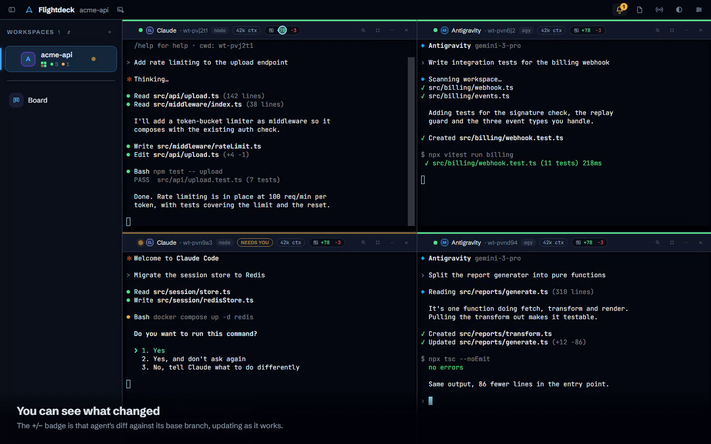

# Flightdeck

Flightdeck is a Windows desktop cockpit for running several AI coding agents at once — Claude Code, Antigravity, local models via LM Studio, and plain shells — each as a live terminal pane in its own git worktree. A review drawer shows the diff for each pane and merges it back on your say-so. An attention queue tells you which pane is waiting on you, a Kanban board lets you dispatch work, and a broadcast bar sends one instruction to several panes at once.

The point is supervision, not throughput. One person directing several agents in parallel, with every change reviewed before it merges, isolated by worktree so one agent's edits can't collide with another's.

## Screenshot



Four panes running Claude Code and Antigravity in parallel, each in its own worktree, with live diff counts and an attention flag on the pane waiting for input. A full walkthrough video is at [kove.nz/flightdeck-demo](https://kove.nz/flightdeck-demo).

## Features

- Multiple agent panes (Claude Code, Antigravity, shells, local models) running side by side, each in an isolated git worktree
- Review drawer: per-pane diff view, local merge-back to the base branch
- Attention queue: surfaces which pane needs a decision, so nothing runs unattended for long
- Kanban board for dispatching work to panes
- Broadcast bar: one instruction fanned out to several panes
- Session persistence (workspaces, panes, board state restore on relaunch), crash/error flight recorder, in-app updater with rollback

## Status

v0.5.4 is the daily driver, running since 2026-08-13. v0.5.5 is cut and pending install. See [STATE.md](STATE.md) for the current session log and [BACKLOG.md](BACKLOG.md) for planned work.

## Tests

- 661 Vitest unit/component tests (frontend)
- 197 Cargo tests (Rust backend)
- 26 Playwright-driven E2E checks against the real frontend (`demo/e2e-session8.mjs`)
- A pane-smoke boot gate (`demo/pane-smoke.mjs`) that boots the real app in Chromium and requires a mounted terminal with no error boundary before any release is cut

All four gates run before a release ships; `tools/release.ps1` wires the boot gate in between the test suites and packaging.

## Run from source

Requires Node 20+, npm, and the Rust stable toolchain.

```
npm install
npm run tauri dev
```

`npm test` runs the Vitest suite. `cd src-tauri && cargo test` runs the Rust suite. Windows-only: the backend uses Win32 Job Objects for process control.

Built installers are not part of the repo. Releases are cut locally with `tools/release.ps1`, which builds, runs the full gate (tests, pane-smoke, boot gate), and writes signed-update metadata to `releases/`.

## Architecture

- Rust backend (Tauri 2) hosts each pane's shell as a ConPTY child process via `portable-pty`, with one dedicated OS thread per pane reading its output
- Frontend is React 19 + TypeScript on Vite 7, terminal rendering via xterm.js with the WebGL addon
- Each pane runs against its own git worktree, created and torn down by the backend; the review drawer diffs and merges a worktree's branch back locally
- Process lifetime is enforced with a Windows Job Object per pane group, so killing a pane's job reliably kills its whole child tree
- Session state (workspaces, panes, board) persists as an atomic JSON document in the app-data directory, with timestamped restore points
- State management on the frontend is Zustand

## How it was built

The code in this repo is written by AI coding agents, directed and reviewed by Balu Premkumar. The architecture decisions, the code review, and every merge are his. Nothing lands without going through the same gate this app is built to enforce: the Vitest and Cargo suites, the Playwright E2E checks, and the pane-smoke boot gate all have to pass before a release is cut.

That gate exists because it caught real failures the hard way. The in-app updater never worked until it was root-caused and fixed for 0.5.4. Release 0.5.2 shipped with a click-offset bug (clicks landing rows away from the pointer at non-default zoom). Release 0.5.3 shipped a boot loop from a missing xterm.js API flag. All three are written up in [STATE.md](STATE.md) alongside the fixes and the gates added afterwards so each class of bug can't pass unnoticed again.

## Licence

MIT, see [LICENSE](LICENSE).

More on this project: [kove.nz/work-flightdeck](https://kove.nz/work-flightdeck).
